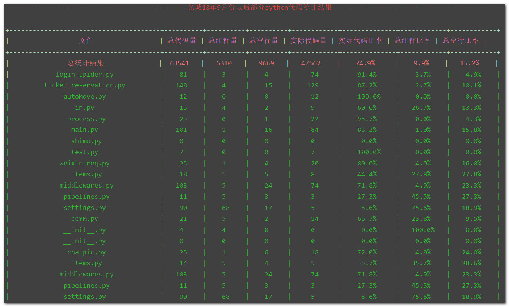
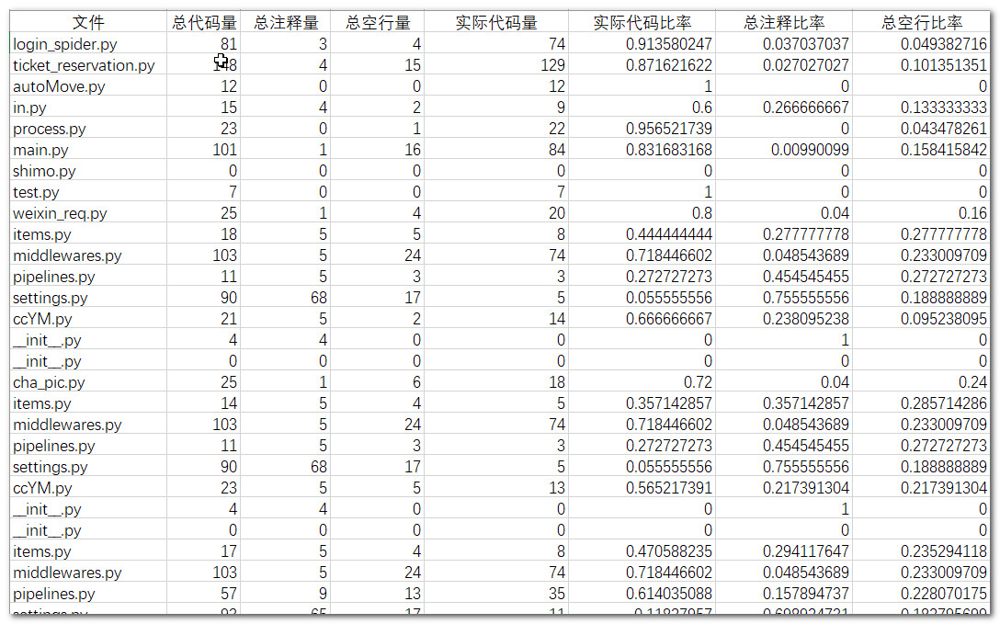
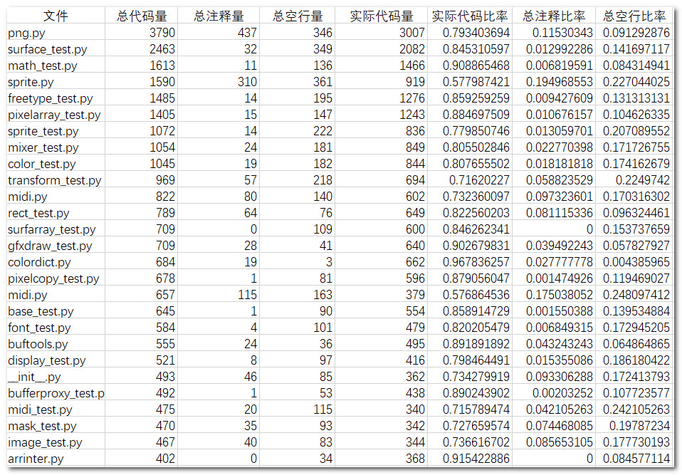
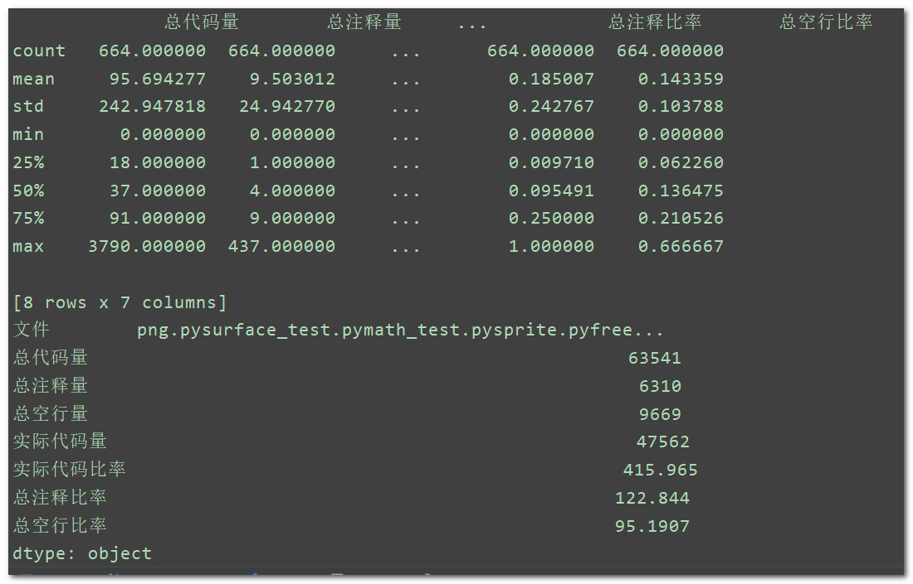

# 2019年第一个开源小项目：玩转统计代码量

## 0.导语

前两天写了个统计自2018年9月撰写本公众号以来写的部分python代码量项目。主要功能及使用见下文，项目已经开源，点击阅读原文即可进入项目仓库。

再来谈一下知识星球，有关知识星球，分享了很多内容，像这次小项目就是在星球内部提出的，3日一个小项目学习，共同交流，除此之外还有每日立了个flag，每日分享干货！
下面一起来看2019年第一个开源项目：玩转统计代码量！

**希望可以顺手star与fork，谢谢!**
## 1.项目功能

- **实现代码统计**

- [x] 代码来源文件
- [x] 总代码量
- [x] 总注释量
- [x] 总空行量
- [x] 实际代码量
- [x] 实际代码比率
- [x] 总注释比率
- [x] 总空行比率

- **csv数据存储**

- [x] csv模块进行数据存储

- **美化输出结果**

- [x] prettytable模块美化输出
- [x] colorama模块颜色配置

- **csv数据统计分析**

- [x] pandas模块读取csv
- [x] pandas模块统计与描述

## 2.你会学到

- [x] python基础
- [x] 面向对象方法
- [x] os模块
- [x] pandas模块
- [x] csv模块
- [x] prettytable模块
- [x] colorama模块

## 3.如何使用

- **下载**

```python
git clone git@github.com:Light-City/year_code.git
```

- **使用**

将代码文件与文件夹放到code_dir，或者修改`static.py`文件里的

```python
dir = './code_dir' # 你的代码文件夹或者代码文件
```

- **运行**

运行`statistic.py`文件，然后会打印输出下面结果，并得到原统计数据data.csv以及排序结果数据sort_data.csv。

- **定制**

```python
def codeSort(self,c_name='实际代码量') # 默认为实际代码量排序
```

使用codeSort函数的时候，可以根据自己的需求来排序，比如可以按照以下参数配置：

codeSort('总代码量')。

可填入：(下面字符串中选择即可)

```
'文件', '总代码量', '总注释量', '总空行量', '实际代码量', '实际代码比率', '总注释比率', '总空行比率'
```

## 4.结果展示
- 美化输出结果



- 数据存储结果



- 排序存储结果

实际代码量排序结果



- 简单统计结果输出



## 5.关于项目与星球
在星球中会做更加详细的代码讲解，如果有问题，星球内部提问会优先回答。

**拒绝伸手党，但我同时拥抱开源，多点留言，多点点赞，多点分享，多点转载，多点赞赏，将是我支持原创的动力！**

最后，关于加入星球，需要说几点：
在星球中，我将用自己的业余时间同你们共同分享交流，我们可以做：
- [x] 更多本文这种小项目
- [x] 组织参加更多比赛
- [x] 共同探讨论文
- [x] 共同研究技术点
- [x] 每日每人分享互动
- [x] 提升坚持与学习的能力！
